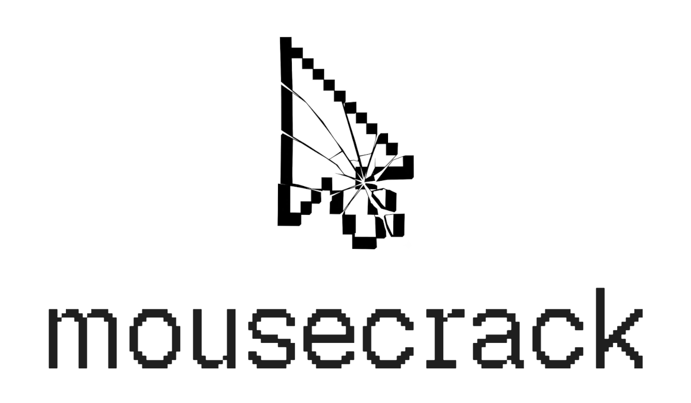

<p align="center">
    
</p>

<p align="center">
Synthesize organically varied, human-like mouse movement.
</p>

<p align="center">
This project aims to test the abilities of deep-learning for mouse imitation.
</p>

<h3 align="center">See it in Action</h3>

https://github.com/user-attachments/assets/ed3339c3-c414-4605-b214-8acf03aca1c1

---

### Installation

```bash
npm i -g mousecrack
```

### Usage

> [!WARNING]  
> This project is still experimental! For educational purposes only.

Available as an SDK (for developers) and CLI (for agents).

#### SDK

```js
import { move, list } from 'mousecrack';

await move(100, 500);
await list(100, 500);
```

#### CLI

```bash
mousecrack move 100 500
mousecrack list 100 500
```

<details>
    <summary>Install the Skill</summary>


For Claude Code:
```
/plugin marketplace add puffinsoft/mousecrack
/plugin install move-mouse@mousecrack
```

For Codex:
```
codex plugin marketplace add puffinsoft/mousecrack
codex plugin add move-mouse@mousecrack
```

</details>

### How does it work?

Mousecrack treats mouse prediction like a time forecasting problem.

It models mouse movement as a change in position (`dx, dy`) and time (`dt`), and tries to predict the next step in this multivariate time series.

To avoid the [mode collapse](https://en.wikipedia.org/wiki/Mode_collapse) problem, Mousecrack uses a Mixture Density Network to model several trajectories as a probability distribution.

---

*Mousecrack* is open source software, licensed under the [MIT](LICENSE) license.
